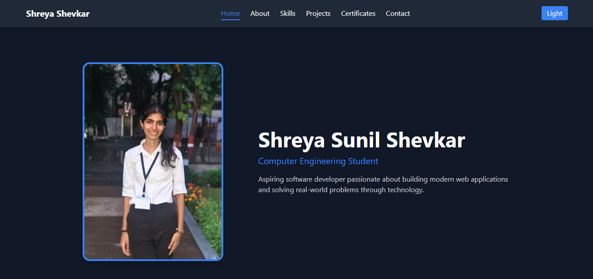

# 🌐 Shreya Sunil Shevkar — Personal Portfolio

A responsive, dark-themed personal portfolio website built with **React** and **Vite**, showcasing my projects, skills, and certifications.

---

## 🔗 Live Demo

> _Add your deployed link here once hosted (e.g. Vercel / Netlify)_

---

## 📸 Preview



---

## ✨ Features

- **Dark theme** with a subtle grid background
- **Sticky navbar** with smooth scroll and active section highlighting
- **Animated sections** — fade-in on scroll, slide-in on page load
- **Responsive design** — works on mobile, tablet, and desktop
- Sections: Home · About · Skills · Projects · Certifications · Contact

---

## 🛠️ Built With

| Technology | Purpose |
|---|---|
| React 18 | UI framework |
| Vite | Build tool & dev server |
| react-scroll | Smooth scrolling & active nav |
| Inter + Manrope | Google Fonts |
| Plain CSS (inline) | All styling |

---

## 📁 Project Structure

```
my-portfolio/
├── public/
│   └── vite.svg
├── src/
│   ├── assets/
│   │   ├── profile.jpeg
│   │   ├── project1.jpg
│   │   ├── proj2.PNG
│   │   ├── cert1.jpg
│   │   ├── cert2.jpg
│   │   └── cert3.png
│   ├── App.jsx        ← Main component + all styles
│   ├── App.css        ← Intentionally empty
│   ├── index.css      ← Minimal reset
│   └── main.jsx       ← React entry point
├── index.html         ← Root HTML with #root reset
└── package.json
```

---

## 🚀 Getting Started

### Prerequisites
- Node.js (v18 or above)
- npm

### Installation

```bash
# 1. Clone the repository
git clone https://github.com/shreyashevkar-28/My_Portfolio.git

# 2. Navigate into the project
cd my_portfolio

# 3. Install dependencies
npm install

# 4. Start the development server
npm run dev
```

The app will run at `http://localhost:5173`

### Build for Production

```bash
npm run build
```

---

## ➕ How to Add Content

### Add a New Project
1. Place your screenshot in `src/assets/` (e.g. `project3.jpg`)
2. Import it in `App.jsx`:
   ```js
   import project3 from "./assets/project3.jpg"
   ```
3. Add a new `<a>` block inside the `projects-grid` section in `App.jsx`

### Add a New Certificate
1. Place the certificate image in `src/assets/` (e.g. `cert4.jpg`)
2. Import it in `App.jsx`:
   ```js
   import cert4 from "./assets/cert4.jpg"
   ```
3. Add a new entry to the `certs` array in `App.jsx`:
   ```js
   { img: cert4, name: 'Your Certification Name', link: cert4 }
   ```

---

## 📬 Contact

| Platform | Link |
|---|---|
| Email | shreyashevkar@gmail.com |
| LinkedIn | [linkedin.com/in/shreyashevkar](https://www.linkedin.com/in/shreya-shevkar-908b11340/) |
| GitHub | [github.com/shreyashevkar-28](https://github.com/shreyashevkar-28) |

---

## 📄 License

This project is open source and available under the [MIT License](LICENSE).

---

<p align="center">Made with ❤️ by Shreya Sunil Shevkar © 2026</p>